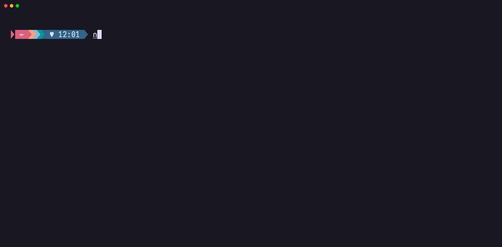

# Wavez Discord Presence

Show what you're listening to on [wavez.fm](https://wavez.fm) as Discord Rich Presence, track, artist, DJ, room, listener count, and a Join the room button so friends can drop in.


Discord's Rich Presence only speaks over a local IPC socket, which a browser tab can't touch. So this ships as two halves: a userscript that reads the wavez page, and a small bridge that relays what it reads into the Discord desktop app.

## Install

You'll need [Node.js](https://nodejs.org) and a userscript manager, preferably [Tampermonkey](https://www.tampermonkey.net). There's no Discord app to register and no config to fill in.

1. Install the userscript via going to [wavez-discord-presence.user.js](https://raw.githubusercontent.com/fluteds/wavez-discord-presence/main/wavez-discord-presence.user.js). Your userscript manager will offer to install it.

2. Run the bridge in the terminal. One command, nothing to clone or install.

```sh
npx wavez-discord-presence
```



3. Open wavez.fm and join a room. Your presence updates on its own.

Leave the bridge running in the background. It's the only piece that can actually reach Discord, if you close the terminal, your presence disappears.

### From source

If you'd rather not use `npx`, or you want to edit the bridge, clone it and run it directly:

```sh
git clone https://github.com/fluteds/wavez-discord-presence
cd wavez-discord-presence
npm install
npm start
```

Same thing, just pinned to the code in front of you rather than the published package. `config.json` goes in this folder.

To install it globally, so `wavez-discord-presence` works as a command from anywhere:

```sh
npm install -g wavez-discord-presence
```

## Config

The defaults work as-is. Skip this unless something clashes.

Copy and rename `config.example.json` to `config.json` (it's gitignored) and set only the keys you care about. Every key also has an env var, which wins over the file.

| Key | Env var | Default |
| --- | --- | --- |
| `appId` | `DISCORD_APP_ID` | The shared wavez.fm presence app |
| `port` | `PORT` | `6969` |
| `largeImage` | `LARGE_IMAGE` | Wavez logo |
| `sourceBadges` | `SOURCE_BADGES` | `false` |
| `lastfmKey` | `LASTFM_API_KEY` | Unset, iTunes is used instead |

`appId`, the Discord application your presence appears under. The bundled default is a public identifier, not a secret. Application IDs ship inside every Discord client, so sharing one is expected and safe. Point this at your own [Discord app](https://discord.com/developers/applications) only if you want a different app name on your profile.

`largeImage`, fallback artwork when a track has no thumbnail. Either an image URL, or the key of an asset you uploaded under Rich Presence → Art Assets in your Discord app.

`port`, change only if `6969` is taken. If you do, update `BRIDGE` at the top of the userscript to match; both ends have to agree.

`sourceBadges`, what the small corner badge on the artwork shows. Off by default, so it's the wavez logo with `wavez.fm` on hover. Set it to `true` and it becomes a YouTube or SoundCloud badge instead, or a **Live** indicator for live streams.

`lastfmKey`, where cover art comes from. wavez only sends the video thumbnail, so the real album cover is looked up by artist and track. Leave this unset and iTunes answers, no key and no setup, which is what `npx` gives you. Set it and Last.fm is asked first, falling back to iTunes when it has no cover, which is worth doing if you listen to anything iTunes doesn't stock. Grab a key from [Last.fm's API page](https://www.last.fm/api/account/create); it's free and instant. The bridge prints which source it's using on startup.

## Troubleshooting

### Nothing shows up in Discord

Check the terminal. `✅ connected to Discord` means it found the desktop app, if it says Discord is unreachable, you're likely on the web version of Discord, which has no IPC socket and cannot work.

### The bridge says `port 6969 is busy`

It's already running in another terminal. Either use that one, or set `PORT` and update `BRIDGE` in the userscript to match.

### The bridge never logs anything when anyone plays a track

The userscript isn't reaching it. Open the browser console on wavez.fm and look for `[wz-presence]` lines; `bridge unreachable` means the bridge isn't running, and no lines at all means the userscript didn't load.

### Presence is stuck on an old track

The bridge clears it after 40s without a heartbeat. If wavez is still open, the userscript has probably stopped, reload the tab.

## License

[MIT](LICENSE)
